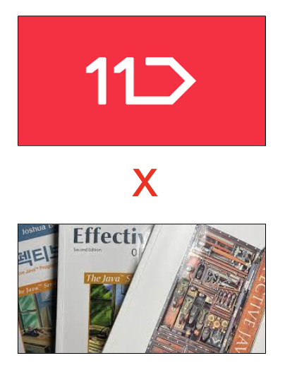

# Study-effectiveJava

**ver2022**
<h1 align="center">
	
	  
</h1>

  

---
## 🧚‍♀️ 구성원 소개

| 0JUUU | Hae-Riri | kimtaejun97 | lllilllilllilili  | judy5050 |
| :-------------------: | :--------------------: | :----------------: | :----------------: |  :----------------: 
|  |    |           |  | 

---
## 📕 Rule 🎯 AIM

- MAX 1H 30M
- DATE : SAT 21H Start
- Who's going to write it?
  - The person who asks the question should write it down in advance.
  - Then we discuss.
  - The person who asks the question summarizes the answers(then we wait)
- There are 3 items for the study. 
- Next : (17), 18, 28, 50
